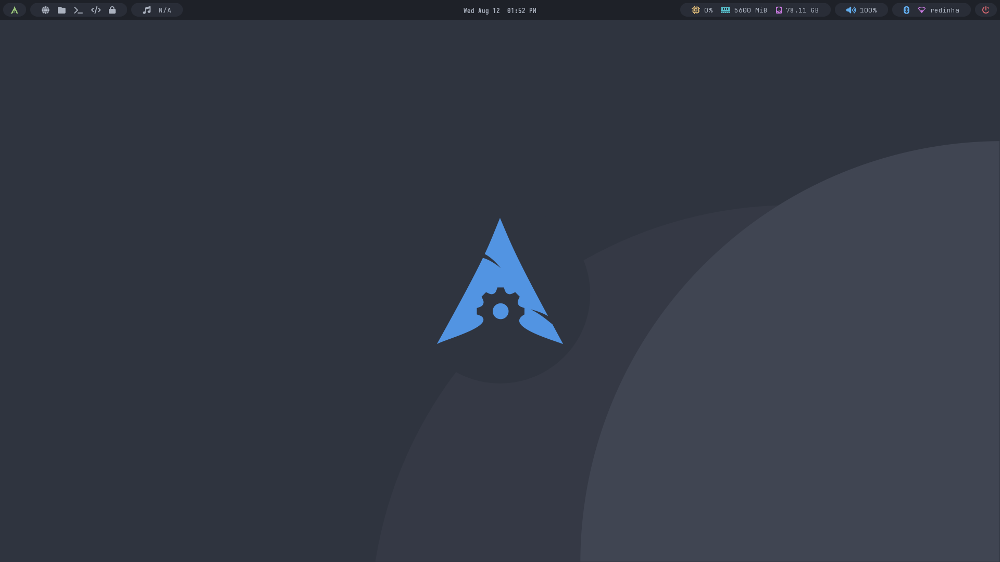

# dotfiles

These dotfiles provide a small change in Archcraft's default theme Polybar and provide a very basic tmux configuration file.

<br />



### Setup

The setup aims to simply remove the default folder, create a symlink on the dotfiles and reload the configurations:

```bash
$ rm -rf ~/.config/openbox
$ ln -s "$HOME/W/dotfiles/.config/openbox" "$HOME/.config/openbox"
$ archcraft-reload-theme
```
